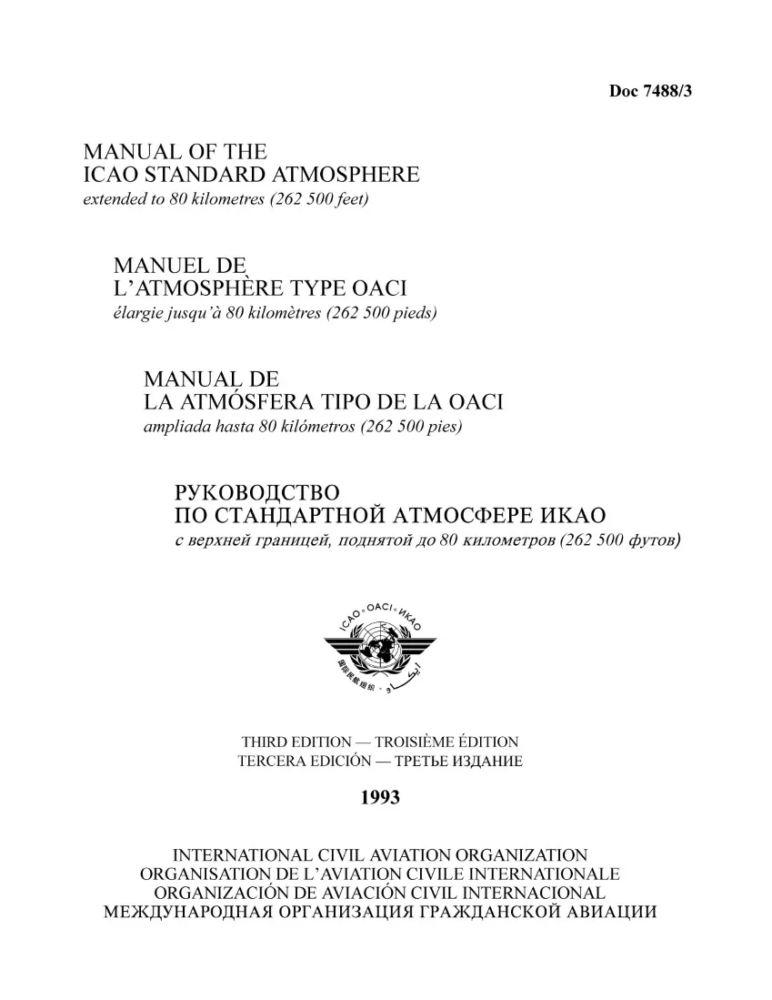
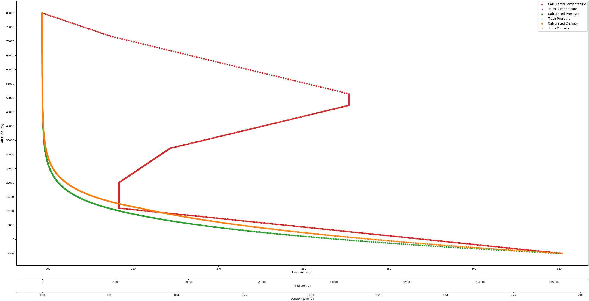
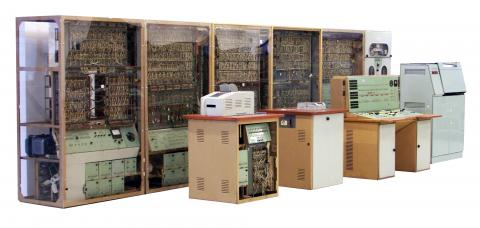

# The International Standard Atmosphere (ISA)
## ISA Description
This model was implemented using the Manual of the ICAO Standard Atmosphere - extended to 80 kilometres / 262,500 feet (Doc 7488). 

The manual provides standard values of atmospheric parameters in tabular form for levels up to 80 kilometres. It also gives values of constants and coefficients, as well as the underlying equations used in the calculation of the atmospheric parameters. The document is intended for use in calculations in the design of aircraft, in presenting test results of aircraft and their components under identical conditions, and in facilitating standardization in the development and calibration of instruments. Its use is also recommended in the processing of data from geophysical and meteorological observations. This manual intends to facilitate the uniform application of the ICAO Standard Atmosphere defined in Annex 8 — Airworthiness of Aircraft and provides sets of data that are accurate enough for practical applications (identical to ISO standard atmosphere).

[](https://store.icao.int/en/manual-of-the-icao-standard-atmosphere-extended-to-80-kilometres-262500-feet-doc-7488)

## Software Model Description
The software model follows the manual's approach to calculating temperature, pressure, and density. All features of the ISA are not currently implemented, although future iterations shall incorporate them, as well as common operations related to the ISA.

## Goal
Accurately model the ISA, for use in multiple target applications.

## Status
Actively in-development\
[X] Temperature\
[X] Pressure\
[X] Density\
[] Specific Weight\
[] Pressure Scale\
[] Number density\
[] Mean particle speed\
[] Mean free path\
[] Collision Frequency\
[] Speed of Sound\
[] Dynamic Viscosity\
[] Thermal Conductivity\
[] Pressure, Temperature, Density Altitude

## Implementation
Following the manual, relationships of the atmosphere are based on base temperatures, and base densities. These two values allow the calculation of base pressure. These base characteristics are accompanied by a lapse rate, which characterizes the change in temperature over a range of altitudes. The lapse rate allows variable temperatures, pressures, and densities to be calculated according to altitude.

## Example Usage
```
use international_standard_atmosphere::isa;
fn main() {
    let icao_standard_atmosphere = isa::ISA::new();
    let test_altitude = 0.0;
    let temperature = icao_standard_atmosphere.temperature(test_altitude).expect("Layer not found.");
    let pressure = icao_standard_atmosphere.pressure(test_altitude).expect("Layer not found.");
    let density = icao_standard_atmosphere.density(test_altitude).expect("Layer not found.");
    println!("Temperature: {}", temperature);
    println!("Pressure: {}", pressure);
    println!("Density: {}", density);
}
```

## Verification
Verification of the model was completed by extracting the data from the manual, for temperature, pressure, and density. These columns were compared to this models implementation for calculating temperature, pressure, and density. Below, you will find this models calculation comparison to the ISA geometric altitude tabulated temperature, pressure, and density.  



There are minute differences in temperature, density, and pressure. It is thought that this could be related to differences in floating point arithmetic and the fact that the original tabulated values were done from a Minsk-22 computer, who's floating point math was completed with nine decimal digits... An investigation is likely warranted, but a solution to this is likely impossible unless someone convinces the International Civil Aviation Organization to update their model! Or it is also likely there is model error.

## History
The International Standard Atmosphere was originally calculated on the Minsk-22 Computer. 

[](https://ajovomultja.hu/minsk-22?language=en)

## Warning
Thoroughly vet this library yourself before using in a real life application.

## Credits
Huge credit to [MeGaGiGaGon](https://github.com/MeGaGiGaGon) for implementing the ability to parse the ISA tables that are available in the ISA Manual.